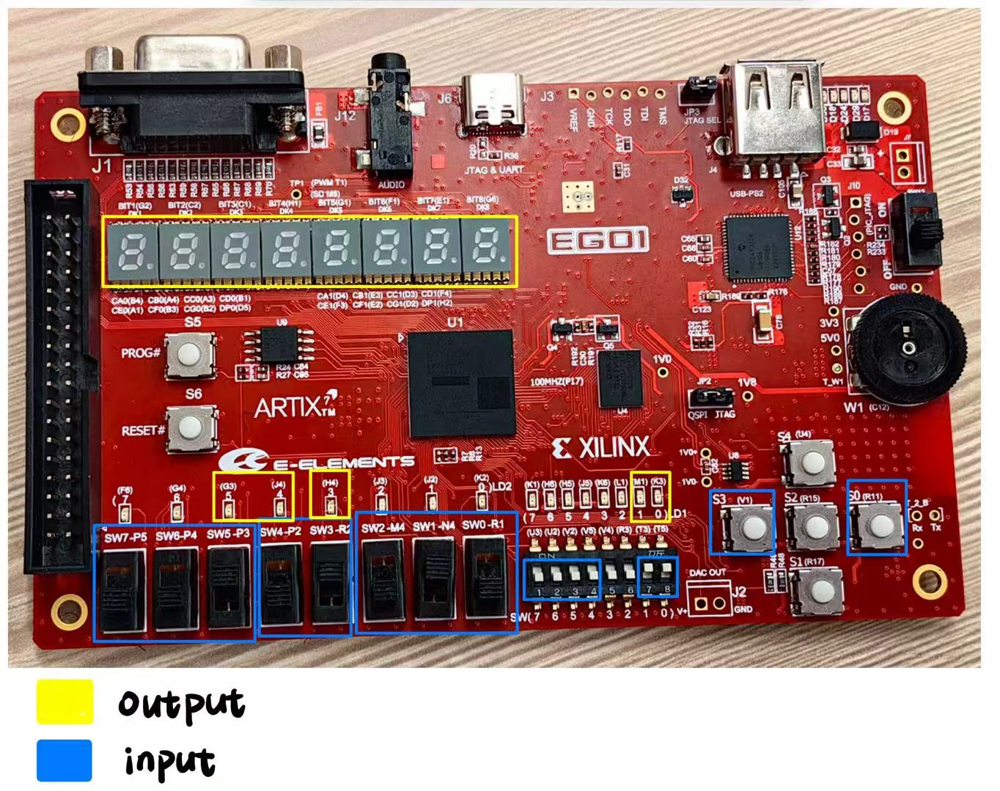

# Architecture Design Document

[TOC]

## Part1. The Input/Output device used in the project

### 1. mark the specific locations of input and output devices on the image of the development board



#### 1. Input device

1. SW7, SW6, SW5 用作`主菜单选择`, SW7为MSB，SW5为LSB
2. SW4，SW3用作`设置选择`,SW4为MSB，SW3为LSB
3. SW2, SW1, SW0 用作`运算选择`, SW2为MSB，SW0为LSB
4. SW(7), SW(6), SW(5), SW(4)用作`标量乘法输入`, SW(7)为MSB，SW(4)为LSB
5. SW(1)用作`set_Uart_tx_work`
6. SW(0)用作`set_Uart_rx_work`
7. S3用作`确认`
8. S0用作`发送`

#### 2. Output device

##### **七位数码显示管**：

1. DK1用作展示目前在哪一主功能
   - 矩阵输入及存储(I)
   - 矩阵生成及存储(G)
   - 矩阵展示(D)
   - 矩阵运算(O)
   - 设置(S)

2. DK4用作目前在哪一种运算方式
   - 矩阵转置(T)
   - 矩阵加法(A)
   - 矩阵标量乘法(B)
   - 矩阵乘法(C)
   - 卷积(J)

3. DK7,DK8用作倒计时。DK7为MSB，DK8为LSB

##### **LD2**： 

1. LED5用作input错误检测：超出维度范围
2. LED4用作input错误检测：超出矩阵元素的数值范围
3. LED3用作operate错误检测：运算数不合规

##### **LD1**： 

1. LED1用作显示set_Uart_tx_work
2. LED0用作显示set_Uart_rx_work

### 2. attach corresponding explanations for the input and output devices in the system

## Part2. Describe the structure of the project

```
matrix_calculator/
├── inputer                  # 矩阵输入模块
|   ├──  matrix_storage_manager   # 矩阵存储管理模块
|   └──  input_validator   # 输入验证模块，用在inputer，处理error（亮灯）
├── generator                # 矩阵生成模块
|   ├──  matrix_storage_manager   # 矩阵存储管理模块
├── displayer                # 矩阵展示模块
├── operator                 # 矩阵运算模块
│   ├── translator           # 矩阵转置模块
│   └── adder                # 矩阵加法模块
|         └──  adder_validator 
│   ├── scalar_multiplexer   # 标量乘法模块
│   ├── multiplexer          # 矩阵乘法模块
|   |     └──  multiplexer_validator 
│   ├──  convoluter          # 卷积模块
|   |     └──  convoluter_validator 
|   └──  timer               # 倒计时模块
└── uart_communicator        # UART通信模块
```

### 1. Circuit sturcture diagram, clearly marking the 1)input/output ports, 2)the the relationship between top-level module and each submodule, as well as the relationships between submodules

### 2. Explain the functions and the input/output ports of each module in the project

## Part3. FSM of the project

### 1. List the states in your project

### 2. Draw the state transition diagram to show the state transmit from one to another
