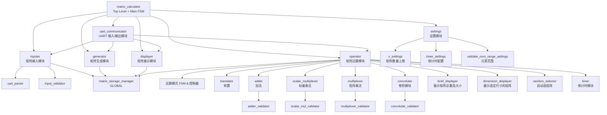
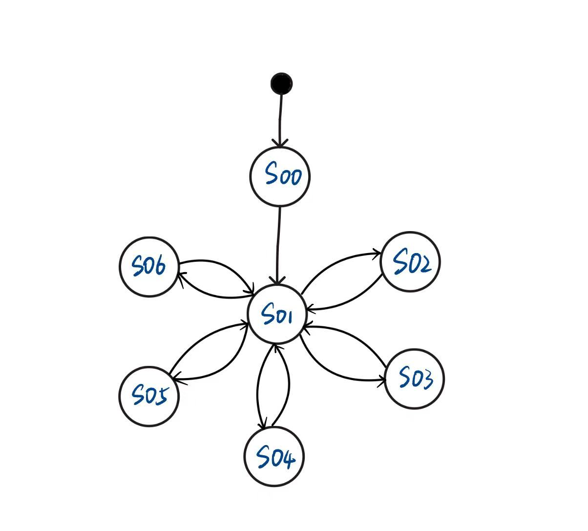
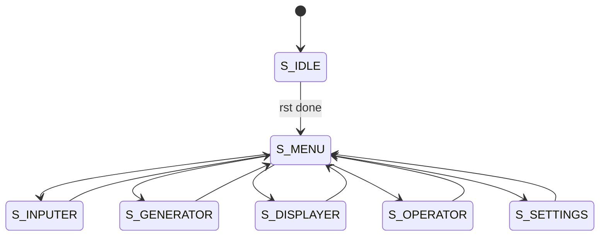
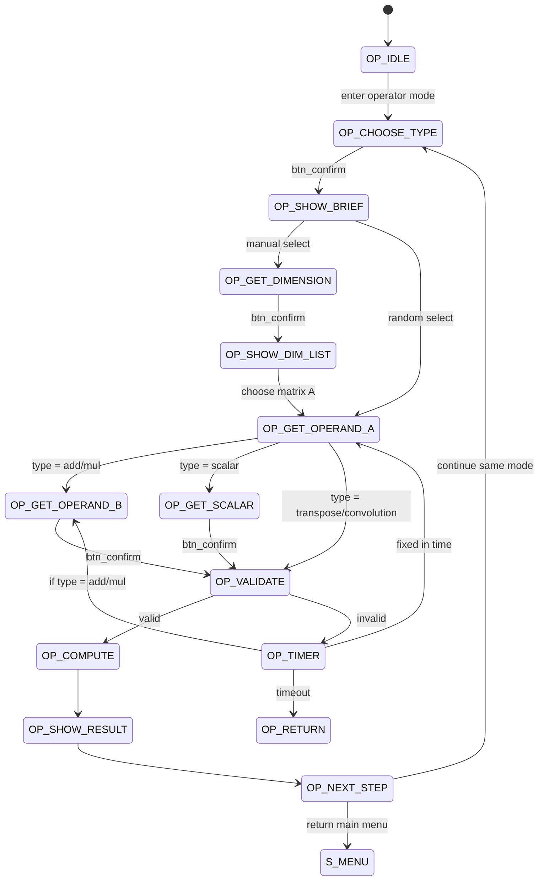

# Architecture Design Document

[TOC]

## Part1. The Input/Output device used in the project

### 1. mark the specific locations of input and output devices on the image of the development board


#### 1. Input device

1. SW7, SW6, SW5 用作`主菜单选择`, SW7为MSB，SW5为LSB
2. SW4，SW3用作`设置选择`,SW4为MSB，SW3为LSB
3. SW2, SW1, SW0 用作`运算选择`, SW2为MSB，SW0为LSB
4. SW(7), SW(6), SW(5), SW(4)用作`标量乘法输入`, SW(7)为MSB，SW(4)为LSB
5. SW(1)用作`set_Uart_tx_work`
6. SW(0)用作`set_Uart_rx_work`
7. S3用作`确认`
8. S0用作`发送`

#### 2. Output device

##### **七位数码显示管**

1. DK1用作展示目前在哪一主功能
   - 矩阵输入及存储(I)
   - 矩阵生成及存储(G)
   - 矩阵展示(D)
   - 矩阵运算(O)
   - 设置(S)

2. DK4用作目前在哪一种运算方式
   - 矩阵转置(T)
   - 矩阵加法(A)
   - 矩阵标量乘法(B)
   - 矩阵乘法(C)
   - 卷积(J)

3. DK7,DK8用作倒计时。DK7为MSB，DK8为LSB

##### **LD2**

1. LED5用作input错误检测：超出维度范围
2. LED4用作input错误检测：超出矩阵元素的数值范围
3. LED3用作operate错误检测：运算数不合规

##### **LD1**

1. LED1用作显示set_Uart_tx_work
2. LED0用作显示set_Uart_rx_work

### 2. attach corresponding explanations for the input and output devices in the system

## Part2. Describe the structure of the project

### 1. Circuit sturcture diagram, clearly marking the 1)input/output ports, 2)the the relationship between top-level module and each submodule, as well as the relationships between submodules

```
matrix_calculator/                    # 顶层模块 (包含主 FSM)
│
├── uart/                             # UART 系统
│   ├── uart_communicator             # UART 收发
│   └── uart_parser                   # ASCII→整数解析
│
├── storage/                          # 全局矩阵存储系统
│   └── matrix_storage_manager        # 矩阵存储+覆盖策略
│
├── inputer_sys/                      # 输入矩阵子系统
│   ├── inputer                       # 处理输入→写入存储
│   └── input_validator               # 维度/数值范围/数量验证
│
├── generator_sys/                    # 随机矩阵生成子系统
│   └── generator                     # 用户指定 m,n,k → 随机矩阵
│
├── displayer_sys/                    # 主菜单矩阵展示
│   └── displayer                     # 展示所有矩阵
│
├── settings_sys/                     # 动态配置模块（Bonus）
│   ├── settings                      # 总控 FSM
│   ├── x_settings                    # 每规格矩阵数量上限
│   ├── timer_settings                # 倒计时秒数（5~15）
│   └── validate_num_range_settings   # 元素范围（默认 0–9）
│
├── operator_sys/                     # 矩阵运算模块（最复杂）
│   │
│   ├── operator                      # 运算主 FSM：选择→验证→倒计时→计算
│   │
│   ├── info_display/                 # 运算菜单展示模块
│   │   ├── brief_displayer           # 显示矩阵总数+规格列表
│   │   ├── dimension_displayer       # 显示指定尺寸所有矩阵
│   │   └── random_selector           # 随机选择运算数/随机标量
│   │
│   ├── validators/                   # 运算合法性验证
│   │   ├── adder_validator
│   │   ├── multiplexer_validator
│   │   └── convoluter_validator      # Bonus
│   │
│   ├── calculators/                  # 具体计算模块
│   │   ├── translator                # 矩阵转置
│   │   ├── adder                     # 矩阵加法
│   │   ├── scalar_multiplexer        # 标量乘法
│   │   ├── multiplexer               # 矩阵乘法
│   │   └── convoluter                # 卷积 Bonus
│   │
│   └── timer                         # 倒计时（数字管、timeout_flag）
│
└── top-level functional glue put in matrix_calculator

```



### 2. Explain the functions and the input/output ports of each module in the project

#### Top-level module

| Module name | Input ports       | Output ports     | Function                   |
|-------------|--------------------|------------------|---------------------------|
| matrix_calculator  | clk, rst, sw_mode[x], btn_confirm, uart_rx | uart_tx, led_err, seg7_sel, seg7_data | 顶层模块，包含主 FSM，负责模式切换并管理所有子模块信号路由   |

#### Global Storage Module

| Module name | Input ports       | Output ports     | Function                   |
|-------------|--------------------|------------------|---------------------------|
| matrix_storage_manager   | clk, rst, write_en, write_data, read_req    | read_data, stored_count, spec_list | 全局矩阵存储器，统一管理数据并支持覆盖策略，供所有模块访问|

#### UART Modules

| Module name | Input ports       | Output ports     | Function                   |
|-------------|--------------------|------------------|---------------------------|
| uart_communicator  | clk, rst, uart_rx                 | uart_tx, rx_byte, rx_data_ready | UART 收发模块，处理串口助手之间的数据通信          |
| uart_parser        | clk, rst, rx_byte, rx_data_ready  | parsed_value, parsed_valid    | 将 ASCII 字符解析为整数，供 inputer/generator/operator 使用   |

#### Inputer Subsystem

| Module name | Input ports       | Output ports     | Function                   |
|-------------|--------------------|------------------|---------------------------|
| inputer           | clk, rst, parsed_value, parsed_valid, btn_confirm  | write_en, write_data, led_err | 处理用户输入矩阵，经验证后写入全局存储器        |
| input_validator   | dim_in, element_in, cfg_range_min, cfg_range_max   | valid_flag                | 检查维度合法性、元素范围、数量不足或超出等情况     |

#### Generator Subsystem

| Module name | Input ports       | Output ports     | Function                   |
|-------------|--------------------|------------------|---------------------------|
| generator   | clk, rst, parsed_value(m,n,k), btn_confirm    | write_en, write_data     | 根据用户指定的 m×n 和数量 k 生成随机矩阵并保存  |

#### Displayer Subsystem

| Module name | Input ports       | Output ports     | Function                   |
|-------------|--------------------|------------------|---------------------------|
| displayer   | clk, rst, read_req | uart_tx_data     | 展示所有存储矩阵（格式化输出），用于 UART 显示     |

#### Settings Subsystem

| Module name | Input ports       | Output ports     | Function                   |
|-------------|--------------------|------------------|---------------------------|
| settings                       | parsed_value, btn_confirm | cfg_x, cfg_range_min, cfg_range_max, cfg_timer | 设置所有动态参数（矩阵数量上限、元素范围、倒计时） |
| x_settings                    | parsed_value         | cfg_x                                         | 设置每种规格矩阵的最大存储数量（默认 2）         |
| timer_settings                | parsed_value         | cfg_timer                                     | 设置倒计时秒数（5–15 秒）                     |
| validate_num_range_settings   | parsed_value         | cfg_range_min, cfg_range_max                 | 设置矩阵元素合法范围（默认 0–9）|

#### Operator Subsystem

| Module name | Input ports       | Output ports     | Function                   |
|-------------|--------------------|------------------|---------------------------|
| operator    | clk, rst, parsed_value, parsed_valid, sw_op_type, btn_confirm | uart_tx_data, led_err, seg7_sel, seg7_data | 运算主控模块，包含运算 FSM，负责选择运算类型、验证、倒计时、调用计算模块并输出结果|

##### Operator 辅助模块

a. Matrix Information Modules

| Module name | Input ports       | Output ports     | Function                   |
|-------------|--------------------|------------------|---------------------------|
| brief_displayer    | stored_count, spec_list             | uart_tx_data     | 显示矩阵数量与规格列表（如 3 2*2*1 4*5*2）          |
| dimension_displayer| dimension(m,n), stored_matrices     | uart_tx_data     | 展示所有 m×n 规格矩阵及其编号，供用户选择           |
| random_selector    | stored_matrices_info                | rand_opA, rand_opB | 随机合法选择运算数；标量乘法生成 0–9 的随机标量    |

b. Validators

| Module name            | Input ports     | Output ports | Function                                   |
|------------------------|------------------|---------------|---------------------------------------------|
| adder_validator        | dimA, dimB       | valid_add     | 判断加法维度是否一致                      |
| multiplexer_validator  | dimA, dimB       | valid_mul     | 判断矩阵乘法的维度是否符合规则            |
| convoluter_validator   | kernel_dim, image_dim | valid_conv | 判断卷积核与图像尺寸是否满足条件（Bonus）|

c. Calculation Modules

| Module name         | Input ports               | Output ports   | Function                           |
|---------------------|----------------------------|----------------|----------------------------------------|
| translator          | matrix_A                   | matrix_AT      | 进行矩阵转置                         |
| adder               | matrix_A, matrix_B         | matrix_C       | 执行矩阵加法                         |
| scalar_multiplexer  | matrix_A, scalar_x         | matrix_C       | 执行标量与矩阵的乘法                 |
| multiplexer         | matrix_A, matrix_B         | matrix_C       | 执行矩阵乘法                         |
| convoluter          | image_matrix, kernel_matrix| result_matrix  | 执行 2D 卷积（Bonus）                |

d. Timer Module

| Module name | Input ports       | Output ports                    | Function                        |
|-------------|--------------------|----------------------------------|---------------------------------------|
| timer       | clk, rst, cfg_seconds | timeout_flag, seg7_sel, seg7_data | 实现倒计时，用于输入错误后的重新选择 |

## Part3. FSM of the project

### 1. List the states in your project

#### 主菜单 FSM

|State id|State name |Meaning|
|--|-----------|-------|
|00|S_IDLE |系统上电，内部寄存器初始化 ，稳态后进入菜单|
|01|S_MENU |主菜单界面（通过拨码开关选择 1–5 功能）|
|02|S_INPUTER| 矩阵输入模式|
|03|S_GENERATOR| 矩阵生成模式|
|04|S_DISPLAYER |展示所有矩阵|
|05|S_OPERATOR |进入矩阵运算模式|
|06|S_SETTINGS |设置模式|

#### 矩阵运算 FSM

|State id|State name| Meaning|
|---|-------|--------|
|00|OP_IDLE |运算模式初始状态|
|01|OP_CHOOSE_TYPE| 用户用拨码选择运算类型（T/A/B/C/J）|
|02|OP_SHOW_BRIEF| brief_displayer 输出矩阵数量和规格列表|
|03|OP_GET_DIMENSION | 输入运算矩阵维度 (m,n)（若手动选择）|
|04|OP_SHOW_DIM_LIST | 显示所有指定维度的矩阵列表|
|05|OP_GET_OPERAND_A |用户选择第一个运算数|
|06|OP_GET_OPERAND_B |用户选择第二个运算数（加法/乘法）|
|07|OP_GET_SCALAR |若为标量乘法：输入标量或随机生成|
|08|OP_VALIDATE |adder/mul/convolution validator 进行合法性检查|
|09|OP_TIMER |运算数不合法 → 进入倒计时状态|
|10|OP_COMPUTE |调用计算模块进行矩阵运算|
|11|OP_SHOW_RESULT |将结果通过 UART 输出|
|12|OP_NEXT_STEP |用户决定继续当前运算/换运算类型/返回主菜单|

### 2. Draw the state transition diagram to show the state transmit from one to another

#### 主菜单 FSM




---

#### 矩阵运算 FSM



