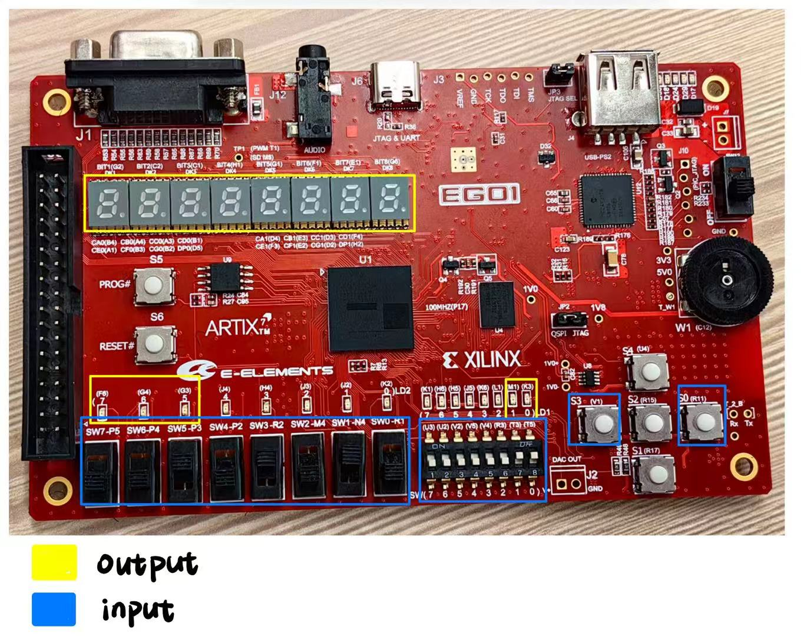

# CS307 数字逻辑设计 Project 1 实验报告

## 1. 开发者说明 (Developer Information)

| 学号  | 姓名  | 负责的工作 | 贡献百分比  |
| :--- | :--- | :--- | :--- |
| 12410148 | 刘以煦| 顶层架构，矩阵生成，UART，随机选择运算数，存储 | 36 |
| 12413323 | 邵浩林| 卷积，运算，存储，矩阵输入，矩阵展示 | 36 |
| 12411443 | 何成卓| 倒计时，按键消抖 | 28 |

## 2. 开发计划日程安排和实施情况
详见以下github链接

* **GitHub Link**: [https://github.com/CS207DigitalLogic/final-project-shl](https://github.com/CS207DigitalLogic/final-project-shl)

* **提交记录**:
- master分支
[https://github.com/CS207DigitalLogic/final-project-shsl/commits/master/](https://github.com/CS207DigitalLogic/final-project-shl/commits/master/)

- display分支
[https://github.com/CS207DigitalLogic/final-project-shl/commits/display](https://github.com/CS207DigitalLogic/final-project-shl/commits/display)

## 3. 项目架构设计说明

### 3.1 **系统总体架构**

本系统采用模块化设计，顶层模块 `integrated_top` 整合了三个主要部分：

1. **主控与通信部分**：负责系统的核心状态机控制、UART 串口通信（接收与发送复用）、矩阵存储管理以及自动运算数选择。
2. **矩阵运算与展示部分**：包含矩阵计算核心（支持转置、加法、乘法）、卷积运算单元、以及矩阵数据的格式化展示逻辑。
3. **辅助功能部分**：提供倒计时控制、按键消抖以及数码管扫描显示驱动。

**数据流向简述**：

* **输入流**：用户通过 UART 输入矩阵数据 -> `uart_rx` 接收 -> `matrix_storage_unit` 解析并存储。
* **控制流**：拨码开关/按键 -> `integrated_top` FSM -> 触发各子模块（如启动计算、切换显示）。
* **计算流**：`matrix_storage_unit` (读端口 A/B) -> `matrix_calculator` / `convoluter` -> 计算结果 -> UART 发送 / 数码管显示。
* **输出流**：各子模块 (展示/计算/选择器) -> `uart_tx_mux` (优先级仲裁) -> `uart_tx` 发送至上位机。

### 3.2 核心模块设计

* **主控与状态机**:
  * **双层状态机架构**：采用了分层设计，分为**主菜单状态**和**子功能状态**。
    * **主状态**：包括 `S_MENU` (菜单), `S_INPUTER` (输入), `S_GENERATOR` (生成), `S_DISPLAYER` (展示), `S_OPERATOR` (运算), `S_SETTINGS` (设置)。通过拨码开关 `sw_right[7:5]` 进行选择，按下 `btn_confirm` 触发跳转。
    * **子状态**：
      * **运算子状态**：在 `S_OPERATOR` 下，进一步细分为 `S_OP_T` (转置), `S_OP_A` (加法), `S_OP_B` (标量乘), `S_OP_C` (矩阵乘), `S_OP_J` (卷积)。通过 `sw_right[2:0]` 选择。
      * **设置子状态**：在 `S_SETTINGS` 下，细分为 `S_SE_n` (数量限制), `S_SE_c` (倒计时配置), `S_SE_r` (数值范围)。通过 `sw_right[4:3]` 选择。
  * **跳转逻辑**：采用典型的三段式状态机写法（状态寄存器 + 次态组合逻辑 + 输出逻辑）。
    * **优先级机制**：状态跳转逻辑具有明确的优先级。在任意子状态下，FSM 首先检查主菜单开关 `sw_right[7:5]`。
      * 若主菜单开关指向其他功能模块（如从运算跳至展示），系统将忽略子功能开关，直接跳转至新的主状态。
      * 若主菜单开关仍指向当前父状态（如在运算子状态下仍选运算），系统才进一步检查子功能开关（`sw_right[2:0]` 或 `sw_right[4:3]`），实现子功能间的快速切换（如直接从加法切到乘法）。
    * **灵活导航**：这种设计确保了用户既可以从任意深度的子状态一键返回主菜单或跳转至其他模块，也可以在同一功能模块下的不同子任务间流畅切换，无需逐层退出。

* **矩阵存储**:
  * **存储结构**：实例化了 `matrix_storage_unit`，内部维护一个支持 **15 个矩阵** (ID 0-14) 的存储堆。
    * **数据组织**：使用二维数组 `mem_data` 存储 4-bit 矩阵元素，配合 `mem_rows` 和 `mem_cols` 数组记录每个 ID 对应的维度信息。
  * **双端口读取与多路复用 (Dual-Port Muxing)**：
    * 为了支持加法和乘法运算，存储单元提供 **Port A** 和 **Port B** 两个独立的读取端口。
    * **资源仲裁**：在顶层模块中实现了复杂的**多路复用逻辑 (Multiplexer)**。由于展示模块、摘要模块、选择器模块和计算模块都需要读取存储器，系统根据优先级（自动选择器 > 运算数展示 > 选择器 > 摘要 > 展示 > 计算器）动态分配读端口的控制权，解决了多模块争用存储资源的冲突。
  * **输入与生成**:
    * **Inputer 模式 (Lookahead 机制)**：直接解析 UART ASCII 流。引入了 **Lookahead (预判)** 机制，在接收到数字字符的当前时钟周期立即计算潜在数值，若超出维度限制 (>5) 或元素限制 (>9) 则立即触发 `RX_ERROR`，无需等待分隔符，解决了传统解析逻辑的滞后问题。
    * **Generator 模式 (批量生成)**：支持 "行 -> 列 -> 数量" 的输入序列。内置 **16-bit LFSR** 生成伪随机数 (模10映射到0-9)。在生成前执行**容量预检**，计算 `当前同规格数量 + 请求数量` 是否超过 `max_per_dim` 设定，若超标则拒绝执行并报错。
  * **动态内存管理**:
    * **策略算法**：通过 `find_and_allocate` 任务实现。
    * **Round-Robin覆盖策略**：维护一个二维指针数组 `overwrite_ptr[row][col]`。当某规格矩阵数量达到上限时，算法不再寻找空位，而是根据该规格对应的指针循环覆盖旧数据，实现了针对特定维度的 FIFO 淘汰机制，确保内存的高效利用。

* **矩阵运算**:
  * **多功能计算核心**: `matrix_calculate` 模块通过 `opcode` 支持四种基本运算：
    * **转置**: 利用坐标变换 `C[j][i] = A[i][j]` 实现。
    * **加法**: 逐元素相加。
    * **标量乘法**: 矩阵每个元素乘以输入的标量。
    * **矩阵乘法**: 实现标准的行列点积运算 `(MxK) * (KxN) = (MxN)`。
  * **状态机控制**: 采用 `S_IDLE` -> `S_CALC` -> `S_DONE` 的三段式设计。
    * 在 `S_IDLE` 状态根据 `opcode` 预计算结果矩阵的维度。
    * 在 `S_CALC` 状态利用计数器 `i, j, k` 遍历矩阵元素进行计算。为了防止数据溢出，中间结果和最终结果采用 **16-bit** 位宽存储 (输入为 4-bit)。
  * **扁平化存储映射**: 内部计算逻辑将二维坐标 `(row, col)` 映射到一维数组索引 `index = row * 5 + col`，以适配扁平化的寄存器阵列。

* **UART 通信**:
  * **协议标准**: 波特率 **115200**，数据位 8，停止位 1，无校验位。
  * **发送多路复用**:
    * 由于系统中有多个模块需要向串口发送数据（矩阵展示、操作提示、计算结果等），在顶层设计了 `uart_tx_mux`。
    * **优先级仲裁**: 采用固定优先级策略，确保关键信息的实时性。例如，正在进行的矩阵展示 (`matrix_uart_display`) 优先级高于空闲时的状态提示。
  * **接收解析**: `uart_rx` 模块负责将串行比特流转为并行字节，并生成 `rx_done` 脉冲信号供 `matrix_storage_unit` 的 Inputer 状态机捕获和解析。
  * **ASCII 格式化**: `matrix_uart_display` 模块负责将 4-bit 的数值转换为 ASCII 码（`0`->`0x30`），并添加空格、换行符和矩阵维度头信息（如 `M0:[2x3]`），实现对人类友好的终端显示。

### 3.3 输入输出端口

本系统在 FPGA 开发板上的端口映射如下，主要分为控制输入（开关/按键）、状态指示（LED/数码管）和数据通信（UART）三部分。

#### 1. 拨码开关 

系统利用左右两组拨码开关实现模式控制与参数输入的复用。

*   **右侧开关组 (`sw_right[7:0]`) - 核心控制与模式选择**
    *   `sw_right[7:5]` **(Menu Select)**: 主菜单模式选择。
        *   `000`: Menu (主菜单)
        *   `001`: Inputer (输入模式)
        *   `010`: Generator (生成模式)
        *   `011`: Displayer (展示模式)
        *   `100`: Operator (运算模式)
        *   `101`: Settings (设置模式)
    *   `sw_right[4:3]` **(Settings Select)**: 设置子项选择。
        *   `00`: 矩阵数量上限 (`n`)
        *   `01`: 倒计时时长 (`c`)
        *   `10`: 数值范围 (`r`)(未实现)
    *   `sw_right[3]` **(Auto Switch)**: 在运算模式下，开启/关闭自动运算数选择功能。
    *   `sw_right[2:0]` **(Op Select)**: 运算子功能选择。
        *   `000`: 转置 (`T`)
        *   `001`: 加法 (`A`)
        *   `010`: 标量乘 (`B`)
        *   `011`: 矩阵乘 (`C`)
        *   `100`: 卷积 (`J`)
    *   **复用功能**:
        *   `sw_right[1]`: 在展示模式下，控制显示摘要 (`1`) 或详细信息 (`0`)。
        *   `sw_right[0]`: 在展示模式下，控制显示所有矩阵 (`1`) 或单选矩阵 (`0`)。

*   **左侧开关组 (`sw_left[7:0]`) - 参数与数据输入**
    *   `sw_left[7:5]`:
        *   **运算模式**: 选择运算数 A 的 ID。
        *   **选择器模式**: 输入行坐标 (Row)。
        *   **设置模式**: 设置每规格矩阵最大数量预览。
    *   `sw_left[4:2]`:
        *   **运算模式**: 选择运算数 B 的 ID。
        *   **选择器模式**: 矩阵索引选择。
    *   `sw_left[7:4]`:
        *   **标量乘模式**: 输入标量值 (Scalar Value)。
        *   **设置模式**: 设置倒计时秒数 (5-15s)。
    *   `sw_left[2:0]`:
        *   **选择器模式**: 输入列坐标 (Col)。

#### 2. 按键

*   **`btn_confirm` (S3 / V1)**: **确认键**。用于触发状态跳转、确认参数设置、启动计算或清除错误状态。
*   **`btn_send` (S0 / R11)**: **发送键**。用于触发 UART 串口发送当前状态下的数据（如矩阵展示、运算数选择信息）。
*   **`rst_n` (P15)**: **系统复位** (低电平有效)。

#### 3. 显示输出 （Display）

*   **七段数码管**
    *   **DK1 (左1)**: 显示当前主状态字符 (`M`:菜单, `I`:输入, `G`:生成, `D`:展示, `O`:运算, `S`:设置)。
    *   **DK4 (左4)**: 显示子功能字符 (如 `A`:加法, `C`:乘法, `J`:卷积, `n`/`c`:设置项)。
    *   **DK5-DK6 (右1-2)**: 在卷积运算完成后，显示计算周期数的高位。
    *   **DK7-DK8 (右3-4)**:
        *   **倒计时模式**: 显示剩余秒数。
        *   **设置模式**: 显示参数预览值。
        *   **卷积模式**: 显示计算周期数的低位。

*   **LED 指示灯**
    *   `led_error` (F6): **错误指示** (红灯)，表示输入非法、容量溢出或运算数不匹配。
    *   `led_busy` (G3): **忙碌指示**，表示正在计算或传输数据。
    *   `led_done` (J4): **完成指示**，表示操作成功结束。
    *   `LED1_uart_tx` (M1): UART 发送活动指示。
    *   `LED0_uart_rx` (K3): UART 接收活动指示。

#### 4. 通信接口 (UART)

*   **UART_RX (N5)**: 接收来自上位机的矩阵数据。
*   **UART_TX (T4)**: 发送计算结果和系统信息至上位机终端。

## 4. Bonus 实现说明

### 4.1 输出对齐

* **个位数输出对齐**: 在 `matrix_uart_display` 模块中，通过状态机控制发送序列，在每个矩阵元素后自动插入空格，在每行结束后插入回车换行符 (`\r\n`)，并在矩阵开始前打印 `Mx:[RxC]` 格式的头信息，确保了串口终端显示的整洁和可读性。

### 4.2 参数配置

* **每规格矩阵存储数量上限配置**：设计了专门的 `S_SETTINGS` 状态，允许用户通过拨码开关动态调整系统参数。可以设置允许存储的最大矩阵数量，防止内存溢出。
* **设计思路**：通过主FSM的 `S_SETTINGS` 分层子状态 (`S_SE_n` / `S_SE_c` / `S_SE_r`) 统一入口，所有配置均在按下 Confirm 后锁存到寄存器，避免拨码抖动直接影响运行态。配置值在离开设置态后仍保持，确保后续运算流程一致。
* **与存储/生成模块关系**：`setting_max_per_dim` 作为上限传入 `matrix_storage_unit`，同时被矩阵生成模式的容量预检使用，覆盖指针基于该上限进行轮转，防止溢出与资源争用。
* **与倒计时模块关系**：`setting_countdown_seconds` 直连 `countdown_unit` 的 `setting_in`，在运算数非法触发倒计时重选时提供统一的超时长度，数码管显示逻辑复用该寄存器的预览值。
* **与运算路径关系**：标量运算在自动模式下优先使用自动选择器生成的 `scalar_value`，手动模式下使用拨码值；所有 UART 展示与自动选择过程均在设置寄存器稳定后读取，避免在配置切换时产生竞态。
* **安全与仲裁**：进入设置态时会清除展示/选择/运算相关的忙信号依赖，配置写入只在 TX 空闲和 Confirm 脉冲时进行，防止与 UART 发送、自动选择或倒计时控制发生冲突。

## 5. 开源及 AI 对于本次大作业的启发和帮助

### 5.1 关于 AI 使用情况和效果

* **使用场景**:
  * **开发环节**: 使用ai生成指定模块的testbench，生成较为简单的辅助模块
  * **调试环节**: 解释 Vivado 综合报错、分析时序违例、逻辑 Bug 定位
  * **文档编写**: 生成代码注释、Markdown 报告格式化、表格生成
  * **具体任务**:
    * **状态机设计**: 辅助生成了 `integrated_top` 中的运算与倒计时结合部分的状态机跳转逻辑框架。
    * **接口对接**: 帮助检查 `matrix_storage_unit` 与 `matrix_calculator` 之间的位宽匹配和信号连接，帮助负责顶层设计的同学在实例化模块时，接口与顶层相对应，间接帮助每一子功能实现后上板测试。
    * **特定模块**: 生成了 `debounce` 和 `uart_tx_mux` 的基础代码等等。
  * **使用的 AI 工具**: GitHub Copilot, ChatGPT, Gemini

* **AI 辅助开发优势和缺陷**:

  * **优势**:
    1. **效率提升**: 能够快速生成 `integrated_top.v` 中繁琐的嵌套 `case` 状态机框架（如主菜单到子功能的跳转逻辑），以及数码管段码解码（`SEG_0` 到 `SEG_9`）的重复性代码，节省了大量打字时间，使开发专注于核心逻辑。
    2. **知识检索**: 快速查找 Verilog 语法细节，例如在 `matrix_storage_unit.v` 中如何正确定义和调用 `task find_and_allocate` 以实现复杂的查找逻辑，以及 `generate` 块在扁平化数组处理中的用法，比查阅手册更直观高效。

  * **缺陷及解决方案**:
    1. **逻辑幻觉**: AI 生成的代码中有时包含不可综合的语法，例如在组合逻辑 `always @(*)` 中因条件覆盖不全导致生成隐含锁存器 (Latch)，或者在 `matrix_storage_unit` 的 `for` 循环中使用了无法静态展开的动态边界。**解决**: 通过 Vivado 的 Synthesis 报错信息定位，并人工重写为固定边界的循环或状态机。
    2. **上下文丢失**: 在处理 `integrated_top.v` 这样的大文件时，AI 经常忘记之前的信号定义（如 `sw_right` 的具体位分配），导致实例化子模块时端口连接名称不匹配（如将 `read_id_A` 误写为 `addr_A`）。**解决**: 采用分模块提问策略，或者在 Prompt 中显式粘贴关键子模块的端口定义部分。

* **提示词工程展示**:

  * **示例 1: 辅助开发Genenrator**
    * **Prompt**:
      > 我现在要完善GENERATOR部分，使顶层状态机切到GENERARTOER模式后实现以下功能：1、用户在输入矩阵时应先输入矩阵的维度（以维度为m×n的矩阵A为例，先输入m再输入n）、矩阵的个数，再按先行后列的方式遍历生成每个矩阵元素的值。例如，用户输入 ”1 3 2“，表示需要产生2个 1*3 的矩阵A和B。2、使用和INPUTER类似的错误检测逻辑。检测矩阵元素大小是否超标（即前两个数是否为0-9，可复用INPUTER的逻辑），检测第三个数是否合法（即同规格已经存储的矩阵数量加上generate的矩阵数量是否超过我们设定的每个矩阵数量大小上限），检测是否是数字而非abc（可复用INPUTER的检测逻辑）若错误，则报错灯亮，需按confirm才熄灭（与INPUTER一样）。
    * **AI 回复摘要**:
      > 输入流程顺滑化：现在不再是按一个键就跳状态，而是使用 parse_val。这意味着你可以输入 1 [空格] 3 [空格] 2 [回车]。即使你输入 01 或 1 (带前导空格)，逻辑也能正确处理（得益于 is_separator 配合 parse_valid 的判断）。   容量预检查 (Pre-check Logic)：在 GEN_WAIT_COUNT 状态下，代码增加了一个 for 循环。由于 HARD_MAX_MATRICES 比较小（15），这个循环在一个时钟周期内展开执行是完全没问题的。逻辑公式：当前已有的同规格数量 + 用户想生成的数量 > 设定上限 ?。如果超标，直接亮红灯 (input_error <= 1) 并锁死在 GEN_ERROR，直到按下 Confirm 3. 错误处理统一：无论是输入了字母（else begin ... input_error <= 1），还是维度不对（parse_val > 5），还是容量超标，都会进入 GEN_ERROR。
    * **交互分析**:
      > 分析为何有效: 提示词清晰地定义了状态机的行为流程（先维度后数量）和具体的输入序列示例（"1 3 2"），消除了歧义。同时，显式要求复用已有的 INPUTER 错误检测逻辑和 Confirm 机制，使得 AI 生成的代码在风格和逻辑上与现有系统保持高度一致，并准确实现了复杂的容量预判功能。

  * **示例 2: 解决多模块 UART 发送冲突与矩阵存储资源仲裁**
    * **输入提示词 (Prompt)**:
      > 我有一个大的顶层模块 integrated_top，里面包含矩阵展示、运算数选择、结果显示、自动选择器等多个子模块，它们都要通过 UART 向上位机发送数据。目前出现了数据乱码问题。同时，这些子模块都需要从 matrix_storage_unit 的两个读端口 (Port A 和 Port B) 读取矩阵数据，但当多个模块同时请求时会产生冲突。请告诉我如何设计一个多路复用方案，确保：(1) UART 发送数据时只有一个模块在发，其他模块排队；(2) 矩阵存储的读端口分配也要有优先级，比如自动选择器、显示、计算器等模块不能同时争夺同一个读端口。我的系统中各模块的优先级从高到低依次是：自动选择器 > 运算数展示 > 手动选择器 > 摘要显示 > 矩阵内容显示 > 计算器。
    * **AI 回复摘要**:
      > UART 发送仲裁：使用一个固定优先级的多路选择器 (Multiplexer)，在每个时钟周期检查各子模块的 tx_start 和 tx_data 信号。将它们合并到一个 tx_data_mux 和 tx_start_mux，然后连接到单个 uart_tx 实例。通过条件运算符 (ternary operator) 按优先级级联：`assign tx_data_mux = module1_busy ? module1_tx_data : (module2_busy ? module2_tx_data : ... : default);`。这样系统保证同时刻最多只有一个模块的信号到达串口，其他模块的请求被自然阻塞（它们会在各自的状态机中等待 tx_busy 信号变低）。矩阵存储多路复用：在存储单元的两个读端口前各设置一个优先级多路器。端口 A 的多路选择逻辑为：`assign mux_read_id_A = auto_selector_busy ? auto_scan_id_A : (operand_display_busy ? operand_disp_read_id : (selector_busy ? selector_read_id : ...));`。类似地为端口 B 设置对应的多路选择。这种设计的核心是：每个周期，高优先级模块一旦开始工作（busy 信号拉高），就会独占该端口，低优先级模块的读请求被暂停。由于读取是组合逻辑（无流水），所以高优先级任务完成后，低优先级任务立即恢复读取，实现了隐式的"轮转调度"。
    * **交互分析**:
      > 分析为何有效：用户清晰地说明了系统中的资源竞争问题（多发送、多读取）和优先级需求，AI 给出的多层级多路选择方案（Cascaded Mux）正是硬件设计中的标准解决思路。相比之下，如果提示词只是说 "有乱码问题"，AI 可能给出的是通用建议，但这里显式的优先级列表和"排队机制"的比喻使得 AI 能够直接生成可立即集成的代码框架。同时，通过对 busy 信号和多路选择的组合讲解，AI 帮助学生理解了硬件仲裁的本质：不是通过队列数据结构，而是通过组合逻辑的优先级编码来实现资源访问的有序化。

## 6. 问题及总结

### 6.1 开发过程中遇到的问题

1. **Vivado 多维数组端口支持问题**:
    * **问题描述**: 在 `matrix_calculate` 模块中，尝试直接将二维数组 `input wire [3:0] matrix_A [0:24]` 作为端口时，Vivado 综合器报错或行为异常，不支持非压缩数组作为顶层端口。
    * **解决方案**: 将端口定义为扁平化的宽向量 `input [99:0] flat_A`，并在模块内部使用 `generate` 块或手动赋值将其重新打包为数组形式进行处理。或者在模块内部保留数组定义，但在实例化时小心处理连接。

2. **UART 发送冲突**:
    * **问题描述**: 多个子模块同时尝试发送数据导致串口输出乱码。
    * **解决方案**: 引入 `uart_tx_mux` 模块，对所有发送请求信号 (`tx_start`) 和数据总线进行集中仲裁，确保同一时刻只有一个模块占用发送通道。

3. **UART 输入解析即时性问题**:
    * **问题描述**: 在矩阵输入模式 (`S_INPUTER`) 下，原有的解析逻辑依赖于分隔符（空格或回车）来触发数值的合法性检查。当用户输入如 "12" 这样超出单元素范围（0-9）的数值时，如果未立即输入分隔符，系统缓冲区会暂存非法值，直到分隔符到来才报错。这导致错误反馈滞后，且在某些边界条件下（如直接发送数据包结束）可能导致非法数据写入。
    * **解决方案**: 在 `matrix_storage_unit` 模块中引入 **Lookahead (预判)** 机制。
        * 定义预判信号 `wire [7:0] lookahead_val = parse_val * 10 + (uart_rx_data - 8'h30);`。
        * 在接收到每一个数字字符的时刻，立即计算“若接纳该字符后的数值”。
        * 若 `lookahead_val` 超出当前上下文的限制（如维度输入阶段 > 5，或元素输入阶段 > 9），则不更新缓冲区，而是立即拉高 `input_error` 并进入 `RX_ERROR` 死锁状态。
        * 这种字符级的即时拦截确保了任何时刻缓冲区内的 `parse_val` 都是合法的，彻底解决了输入溢出检测滞后的问题。

### 6.2 个人反思和总结

* **个人反思**:
  * **软硬件协同设计的理解**: 本次项目让我们深刻体会到了硬件描述语言与软件编程思维的本质区别。在设计矩阵存储和运算模块时，必须时刻考虑时钟周期、资源占用和并行性，而非仅仅关注算法逻辑。例如，为了解决 UART 输入解析的滞后问题，我们引入了 Lookahead 机制，这种对时序精确控制的要求是纯软件开发中很少遇到的。同时，通过 UART 与上位机交互的设计，也让我理解了底层硬件如何为上层应用提供稳定接口。
  * **关于团队协作的体会**: 多人协作开发 FPGA 项目极具挑战性，尤其是模块间的接口定义（如握手信号、数据位宽）至关重要。我们在初期花费了大量时间商定 `integrated_top` 与子模块的交互协议，这大大减少了后期的集成难度。通过 Git 进行版本控制和分支管理，我们有效地并行开发了展示、运算和存储功能，最终顺利完成了系统整合。

### 6.3 项目和课程改进建议

* **在 AI 大模型时代，本课程的实践项目 (Project) 应如何设计**:
  * **增加系统架构设计的比重**: 减少纯粹的重复性模块编写（如简单的计数器、译码器），将重心转移到模块间的接口协议设计、时序约束分析和资源优化上。AI 擅长生成局部代码，但系统级的整合仍需人类工程师的全局视野。
  * **强制包含验证环节**: 要求提交详细的 Testbench 和仿真波形分析，甚至可以引入覆盖率检查。因为 AI 生成的代码往往缺乏完备的边界情况处理，通过严格的验证来发现 AI 的逻辑漏洞应成为项目的重要组成部分。
  * **AI 交互文档化**: 建议要求学生提交 "AI 协作日志"，记录 Prompt 的设计思路和对 AI 生成代码的修正过程（如本报告第 5 节所示），评估学生 "驾驭工具" 而非 "依赖工具" 的能力。

* **AI 大模型时代，数字逻辑课程的考核方式应如何调整**:
  * **强化现场答辩 (Code Review)**: 考核重点从 "代码是否跑通" 转向 "是否理解代码"。例如，现场要求学生修改状态机的某一部分逻辑，或解释关键信号的时序关系，观察其能否快速定位并正确调整，以防范盲目复制粘贴。
  * **引入 "Bug Fix" 考核**: 提供一段由 AI 生成但包含隐蔽时序问题（如跨时钟域问题、隐含 Latch、阻塞赋值误用）的代码，要求学生分析综合报告并修复。这种逆向分析更能考察学生对底层硬件原理的掌握程度。
  * **侧重测试用例设计**: 考核学生设计 Corner Case（边界测试用例）的能力。AI 可以生成代码，但往往难以构想出覆盖所有极端情况的测试场景，这是体现人类逻辑严密性的关键环节。
